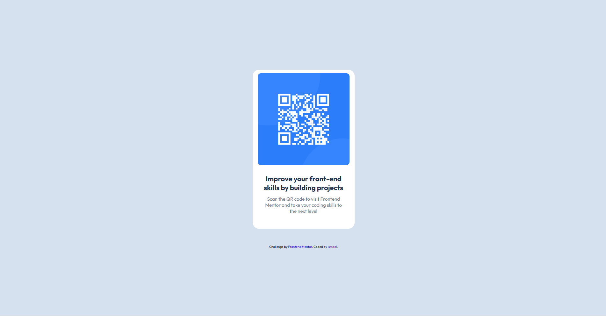

## Table of contents

- [Overview](#overview)
  - [Screenshot](#screenshot)
  - [Links](#links)
- [My process](#my-process)
  - [Built with](#built-with)
  - [What I learned](#what-i-learned)
  - [Continued development](#continued-development)
  - [AI Collaboration](#ai-collaboration)
- [Author](#author)

## Overview

### Screenshot

### Links

- Solution URL: [Add solution URL here](https://your-solution-url.com)
- Live Site URL: [Add live site URL here](https://your-live-site-url.com)

## My process

### Built with

- Semantic HTML5 markup
- CSS custom properties
- Flexbox

### What I learned

I learned to use basic semantic HTML markup and CSS basic layout tools such as Flexbox, box model, font, colors and other essencial resources.

### Continued development

I would like to learn about resposive pages, it's important.

### AI Collaboration

Describe how you used AI tools (if any) during this project. This helps demonstrate your ability to work effectively with AI assistants.

- What tools did you use?
  I used Deepseek.
- How did you use them?
  I tried to move dow to the middle of the page (to the center), the div wich is the background card that contains the intern elements that compose the qr code ("qr-code-card" in the code) but I could because I hadn't given heigh to the parents tags body and html. I sent a screenshot to Deepseek asking what was the problem and he explained me about the ancestor's need to have a height too. 

- What worked well? What didn't?
  It was a good assistand and worked very well.

## Author

- Frontend Mentor - [@Ismael-global](https://www.frontendmentor.io/profile/Ismael-global)
